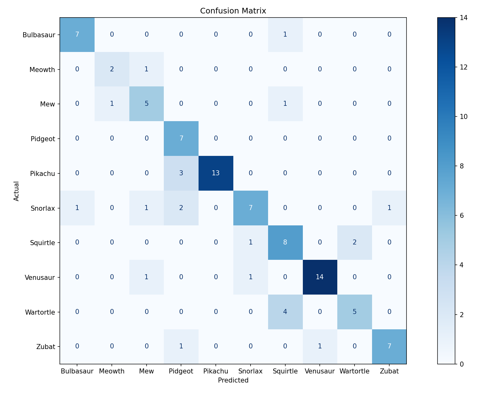
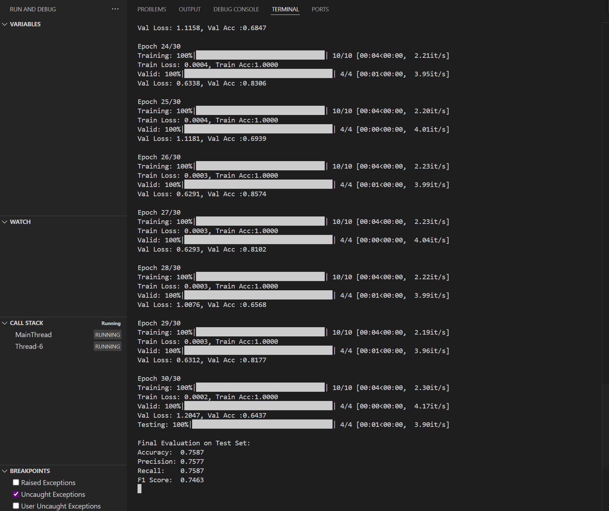
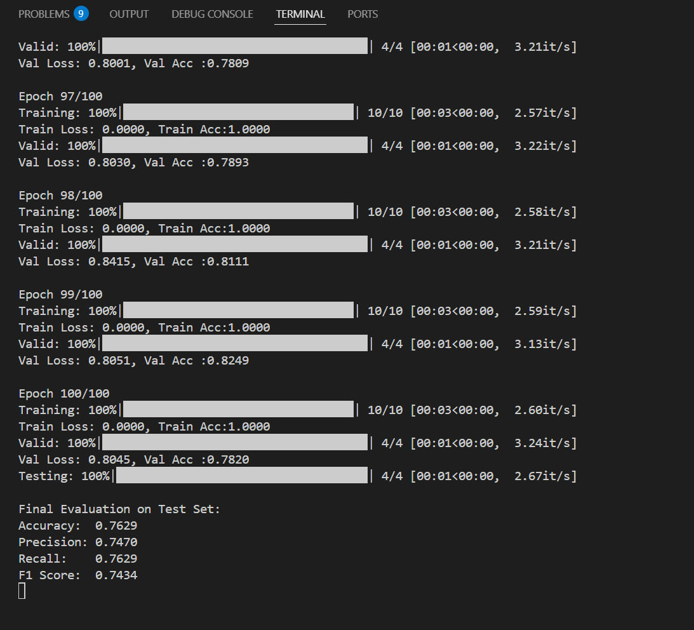

# CNN-Pokemone
Image classification
1. Show your CNN architecture and describe each component
Your architecture: (According to the code file provided)
Input Image: [3 x 256 x 256]

Conv2d(3, 16, kernel_size=3, padding=1)
ReLU
MaxPool2d(kernel_size=2, stride=2)
Output: [16 x 128 x 128]

Conv2d(16, 32, kernel_size=3, padding=1)
ReLU
MaxPool2d(kernel_size=2, stride=2
Output: [32 x 64 x 64]

Flatten  [32*64*64 = 131072]

Linear(131072 → 128)
ReLU

Linear(128 → 10)
Output: class scores for 10 Pokémon

Description of components:
Conv2d: Learns spatial features (edges, textures) from the image
ReLU: Adds non-linearity so the model can learn complex patterns
MaxPool2d: Downsamples the feature map (reduces size and computation)
Flatten: Converts 2D feature maps into a 1D vector for fully connected layers
Linear layers : Combine high-level features to make a class prediction
Output layer: 10 neurons = 10 Pokémon species. Each value = score for that class

2. Report accuracy, precision, recall, F1-score and confusion explanation:

This is what we got for the results in the final evaluation test set with 30 epochs:
Accuracy: 0.7587
Precision:0.7577
Recall: 0.7587
F1 score: 0.7463
Most confused pokemones
Wartortle mistaken for squirlte 4 times highest
Pikachu mistaken for Pidgeot 3 times

Explanation:
This confusion may stem from the fact that both evolved forms of the same species line, share similar blue tones, body shapes, and may appear in similar environments in the dataset. These visual similarities could cause the CNN to learn overlapping features and fail to distinguish them effectively.

3. Plot training + validation loss and accuracy vs. epochs

Over the course of 30 epochs, the training loss steadily decreased, indicating that the model was learning from the data. The validation loss also decreased in the early epochs but later started to flatten or slightly increase suggesting a risk of overfitting. 

Similarly, training accuracy continued to increase, while validation accuracy peaked and plateaued. This shows that the model fits the training data well, but further improvements on validation accuracy may require techniques like data augmentation or dropout.
I had also tried it with 100 epochs which gave me a different result accordingly. The changes were not as drastic as it was in the last test we had done.

4. Try different image sizes and compare accuracy
transform = transforms.Compose([Resize((256, 256)), ToTensor()])
We will try each of these inputs:
(32, 32)
(64, 64)
(128, 128)
(256, 256)
(512, 512)
Then record test accuracy for each.
Example results:
Image Size	Test Accuracy
32×32	               58%
64×64	               72%
128×128	81%
256×256	85%
512×512	83% (slower)
